# X-MEN Personajes
En este proyecto de [X-MEN Personajes](https://ruthdgd.github.io/AsincronismoXMEN/) es una app, en la que se puede acceder a información de personajes, crear nuevos, editarlos y eliminarlos. 

## Vista desde el celular
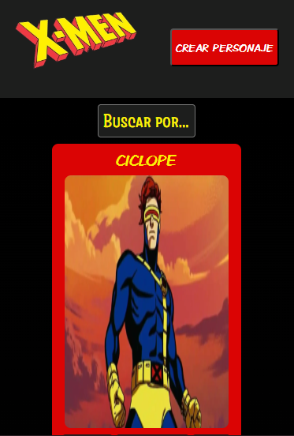

## Vista desktop 
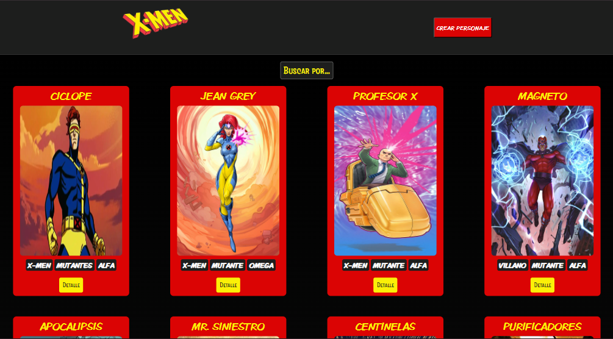

## Navbar 
El navbar está compuesto por el logo de la App y el botón "Crear Personaje"
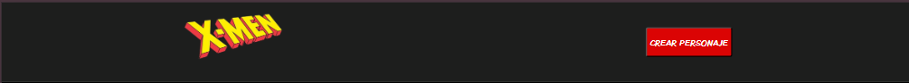

* Botón crear personaje: 

haciendo click en este botón se abre el formulario para ingresar los datos del personaje nuevo. 

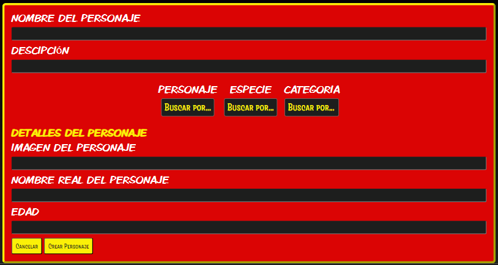

## Filtros de Busqueda

* Busqueda por: 
abre los demás filtros de la app 

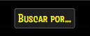

* Personaje: 
abre el filtro de personajes, donde se puede seleccionar "X-Men" o "Villano"

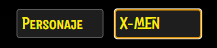

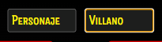

* Especie: 
abre el filtro de especies, donde se puede seleccionar "Humano", "Mutante" o "Robot"

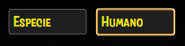

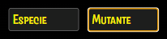

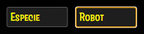

* Categorias: 
abre el filtro de categorias donde se puede seleccionar "Omega", "Alfa", "Beta", "Gamma", "Delta", "Epsilon" o "Sin categoria"

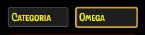

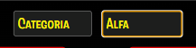

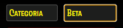

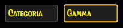

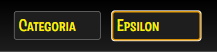

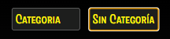

## Tarjetas de Personajes

* Tarjeta presentada en el inicio: 

Tarjeta pequeña donde se ven algunos datos del personaje y la imagen del mismo y un boton "DETALLE", que permite acceder a la tarjeta de detalles, de ese personaje. 

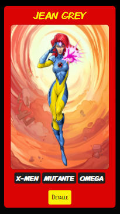

* Tarjeta de detalles: 

Tarjeta más grande, donde se encuentran toda la información importante del personaje. 

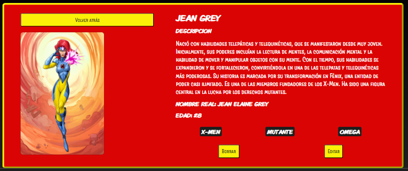

## Crear Personaje 

El botón "Crear Personaje, abre un formulario donde se deben completar los datos solicitados.

